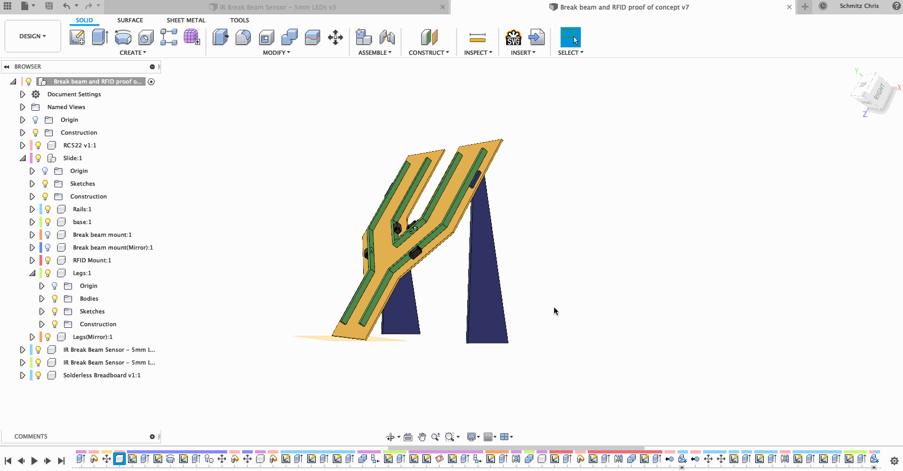

# RFID + Break Beam proof of concept.

This is a proof of concept for a larger plinko-esq project that a co-worker of mine and I are working on.

This poc is to test out the use of break beam sensors for detecting plinko slot position and a RFID reader to determine what plinko disk was used.
