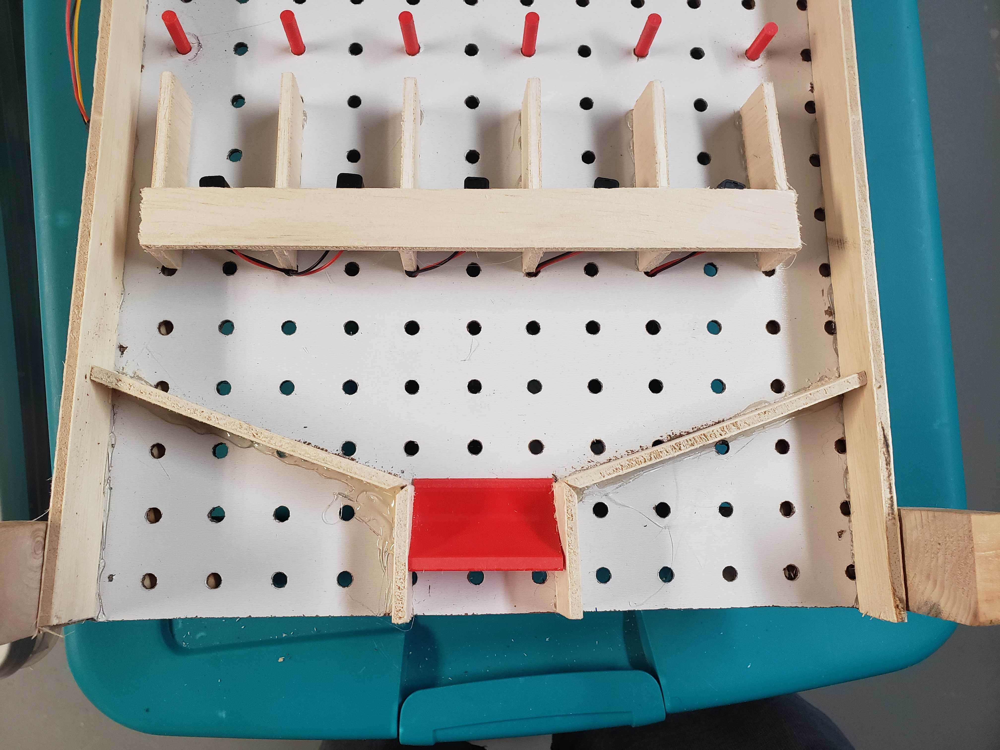

# Pegasus

Pegasus is a Plinko Electronic Game that [I'm](https://paradowski.com/people/chris-schmitz) working on with my friend/co-worker [Terri Mitchel](https://paradowski.com/people/terri-beth-mitchell).

The idea is to create a plinko-esq game that genrates art, hands out fortunes, and probably other stuff as the idea evolves ;P

## Watching progress

As I go I've been documenting progress over on [my vimeo channel](https://vimeo.com/showcase/5998651).

This project is still in progress, so the readme isn't going to be ultra verbose. I'll be filling it in more as I go.

## Prototype

Right now I'm in proof of concept and prototype mode for this project. We started with the idea of a final project, so now I'm walking back to figure out how to make all of the bits and pieces of that work.

If you want to dig around in the code that I'm using to figure everything out you can check out the [prototypes-and-pocs](https://github.com/chris-schmitz/pegasus/tree/master/prototypes-and-pocs) directory of this repository.

## Proof of concept

