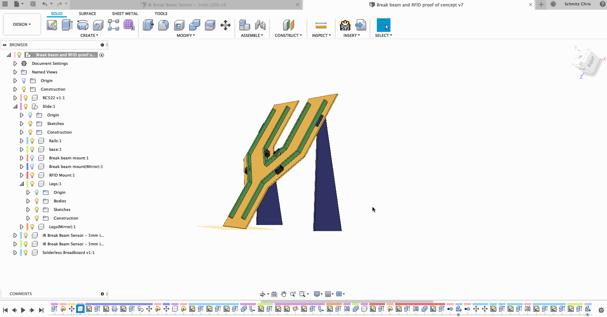
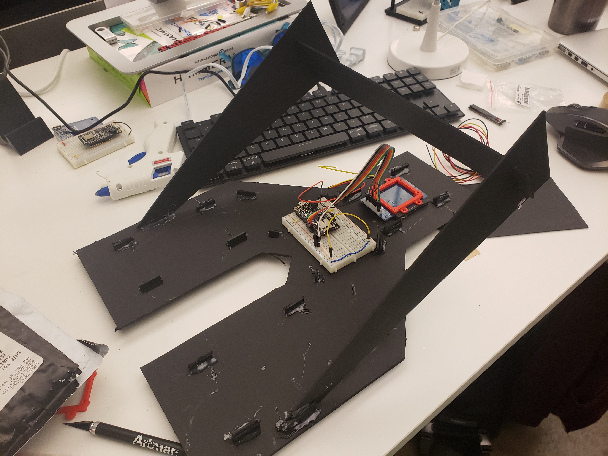

# Breakbeam and RFID proof of concept

This was the first Proof of concept I worked on when thinking out how to build this project.

You can see a video of it [here on my vimeo channel](https://vimeo.com/331064511)

After talking through with Terri as far as what we wanted to build and how we thought it should work and look it was clear that the first things that we needed to prove out were:

-   Can we get the break beam sensors and RFID sensor to work together?
-   Will the timing work?
-   Can we physically build out, wire, and program a fork that represents the lanes the machine will use and the funnel for the rfid sensor?

Once I proved this out I moved on to designing the prototype for the game.
