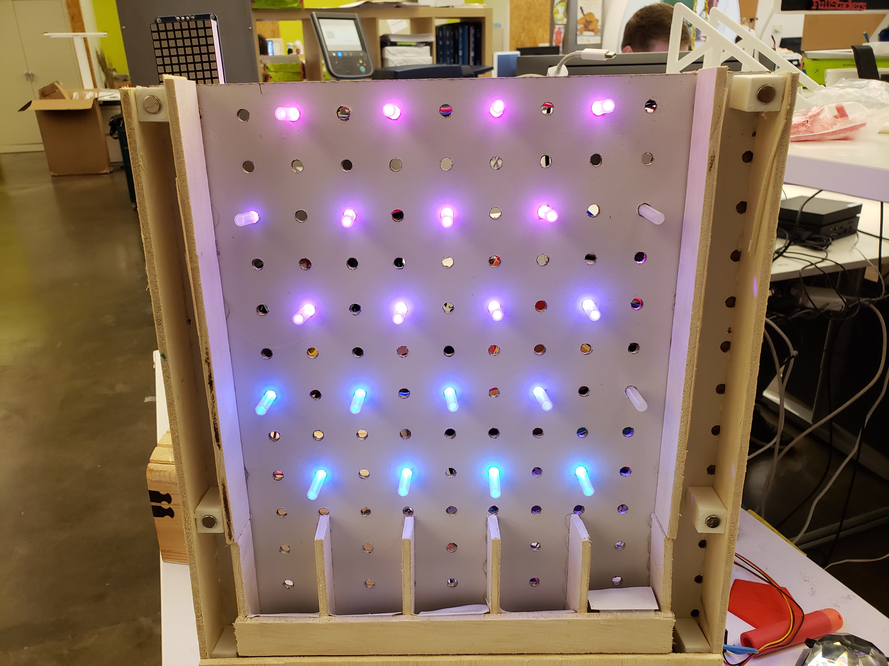

# Peg lights

[Video of the pegs in action](https://vimeo.com/336592458)

## The reasoning

When talking about this project with co-workers, friends, family, strangers on the street, I got a lot of really cool suggestions and ideas of things I could add. One that I _really really_ wanted to do was to add LEDs to the backs of the pegs and then control them indvidually.

I don't consider this MVP, but I wanted to take the time to do it. I also didnt' want to add this in to the main prototype code because I knew this part could be ripped out or switched easily. Aaand I didn't want the LED controls to add to the loop slowdown in the main game logic.

For all of these reasons I decided to handle the peg light controls (and other ancillary logic (cap touch on peg idea that I liked, sound effects, etc)) in a separate sketch with a separate microcontroller.

Really, there's not really a reason to have all of it controlled in the same sketch anyway and the timing on when to handle the lights and sound isn't so critical that it needs to happen in exact step with the main game logic so the separate controller seems like more of an advantage than a convienence. We can ask future me how that worked out ;)

## The modeling

To make the LED backed pegs I hopped into Fusion360 and modeled out custom pegs, led mounts, and clips. The goal was to avoid supports with printing (breaking the model into 3 pieces), and to make it easy to swap out LEDs if necessary (I trust my soldering and circuit planning skills, but not completely).

I'm not 100% happy with the peg design yet (still a little iff-y re: clip hold strength), but once I'm happy I'll throw it up on thingiverse.
