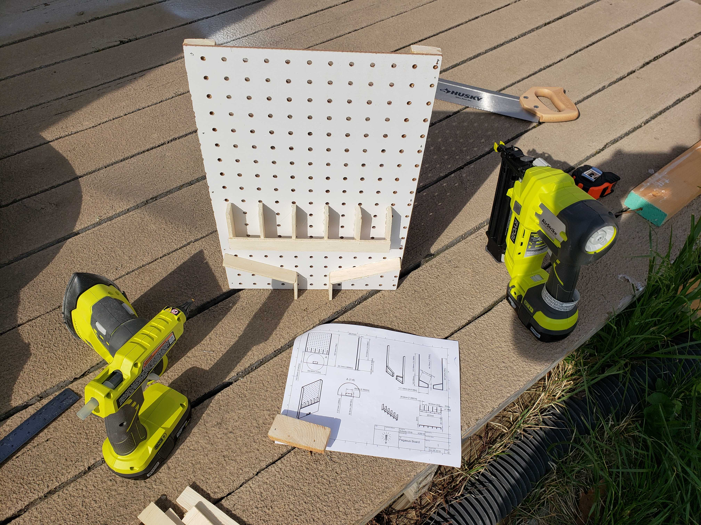
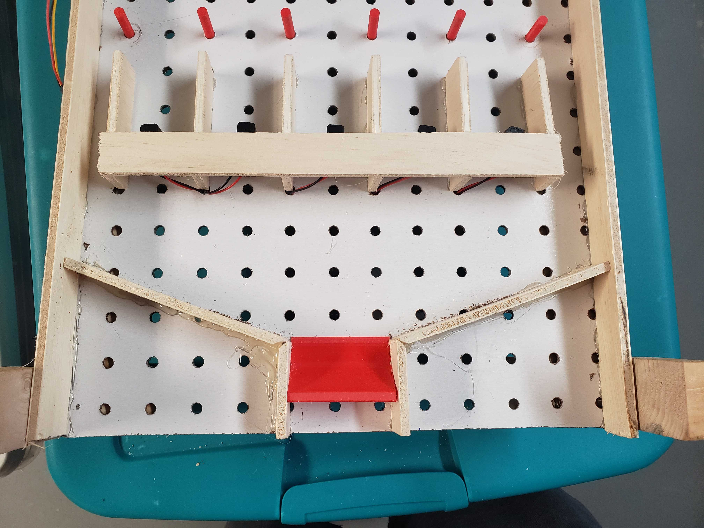
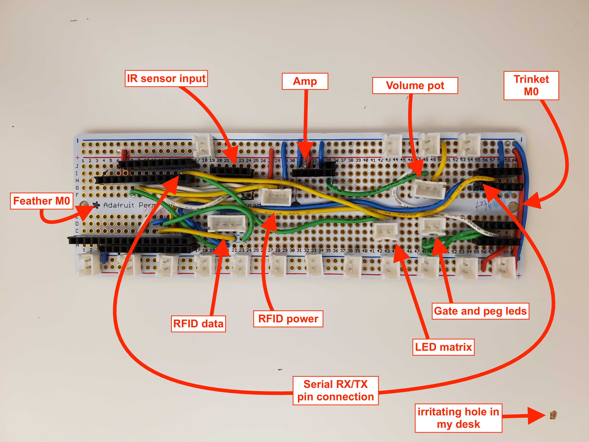

# Plinko Prototype

This is the main game prototype where I'm working out the MVP for what will become the P.E.G.asus game.

[Fabrication vid](https://vimeo.com/336353551)

## Prototype circuit layout

I don't know how to draw decent circuit diagrams yet so a pic will have to do.

## MVP

The mvp for this prototype is:

-   Multiple disks with RFID tags embeded into them
-   Gates with break beam sensors to detect state
-   RFID sensor behind the funnel to detect what disk is in play
-   A playable board
-   A visual way of representing the state that's not just a serial monitor
-   Easy access to all parts

This part is still in progress
