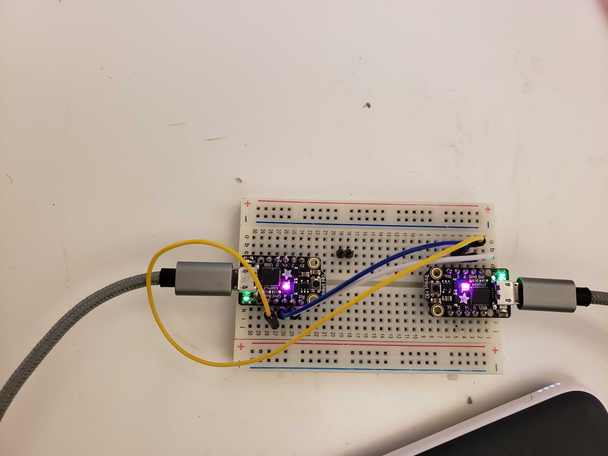
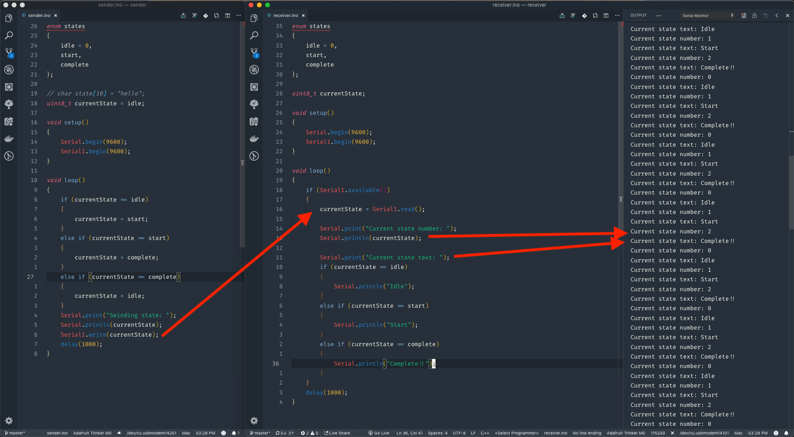

# Sender -> Receiver proof of concept

This is a quick proof of concept to prove out simple serial communication between two microcontrollers via the RX and TX pins.

## Explanation

In the main project I know that I'm going to want to controll the main game logic and the audio/visuals with separate controllers, both to make the code easier to manage and so that later if I want to switch out how I handle audio/video (which I'm positive we will want to do for different form factors) it will be eaiser.

It's kind of funny, I'm used the idea of abstracting code and using interfaces to talk between different parts of a system, but I've never really planned and done it with physical hardware. It's kind of wild :D
